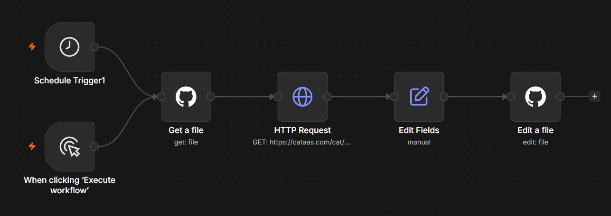

# n8n GitHub README cat updater

A small n8n workflow that reads a target repository `README.md`, fetches a fresh cat GIF URL from CATAAS, replaces a marked section in that README, and commits the updated file back to GitHub.

This repository is meant as a learning exercise for GitHub file operations, Base64 decoding, HTTP requests, string replacement, and automated commits.

This repository stores the workflow export and documentation. The workflow itself is meant to update another repository, such as a GitHub profile repository like `RodrigoWitkowski/RodrigoWitkowski`.

## Workflow preview



## Managed README block

The workflow replaces the content between the `CAT GIF START` and `CAT GIF END` HTML comments in the target repository's `README.md`.

Example block for the target README:

```md
<!--CAT GIF START-->

<!--CAT GIF END-->
```

Keep exactly one managed block in the target README so the replacement stays predictable.

## Workflow summary

1. Starts manually or from `Schedule Trigger1`.
2. Reads `README.md` from a target GitHub repository.
3. Decodes the Base64 content returned by the GitHub API.
4. Requests cat metadata from CATAAS.
5. Replaces the managed README block with a new Markdown image.
6. Commits the updated README back to GitHub.

## Repository files

```text
.
|-- image.png
|-- README.md
|-- n8n-github-workflow.json
```

## Requirements

- An n8n instance, either self-hosted or n8n Cloud.
- A GitHub account.
- A GitHub repository whose `README.md` you want to update.
- A GitHub personal access token with repository contents write access.

## Setup

### 1. Import the workflow

In n8n, import:

```text
n8n-github-workflow.json
```

The export in this repository is sanitized for public sharing.

### 2. Create the GitHub credential

Create a GitHub API credential in n8n with a fine-grained personal access token.

Recommended repository permission:

```text
Contents: Read and write
```

Do not place the token in workflow JSON, screenshots, README content, or Git history.

### 3. Select the credential in both GitHub nodes

After import, open:

```text
Get a file
Edit a file
```

Select your GitHub credential in both nodes.

### 4. Configure the target repository

In both GitHub nodes, replace:

```text
YOUR_GITHUB_USERNAME
YOUR_REPOSITORY
```

The exported workflow assumes the target file is:

```text
README.md
```

The target repository can be different from this repository.

For a GitHub profile README, use your username for both values. Example:

```text
Owner: RodrigoWitkowski
Repository: RodrigoWitkowski
```

### 5. Prepare the target README

Make sure the target repository's `README.md` contains exactly one managed block using the same marker comments shown above.

If the markers are missing, the replacement expression leaves the file unchanged.

### 6. Check the HTTP Request node

The exported workflow calls:

```text
https://cataas.com/cat/gif
```

It sends `Accept: application/json` so CATAAS returns metadata with a cat URL instead of raw GIF bytes.

### 7. Optional: configure the schedule

Open `Schedule Trigger1` and choose when the workflow should run. Before relying on the schedule, confirm the workflow timezone in n8n matches your expected runtime.

### 8. Test manually

1. Open the workflow.
2. Click `Execute workflow`.
3. Confirm `Get a file` returns the README content.
4. Confirm `HTTP Request` returns cat metadata.
5. Confirm `Edit a file` creates a commit.
6. Open the target repository on GitHub and verify that its README now points to a fresh cat GIF URL.

### 9. Activate the workflow

After the manual test succeeds, save and activate the workflow.

The schedule only runs automatically while the workflow is active.

## How the replacement works

The workflow decodes the GitHub file response with:

```javascript
{{ $('Get a file').item.json.content.base64Decode() }}
```

It then replaces the managed block with a new Markdown image. The exported expression also normalizes relative CATAAS URLs into absolute ones before committing the file back to GitHub:

```javascript
{{
  (() => {
    const catUrl = $('HTTP Request').item.json.url || '/cat/gif';
    const absoluteCatUrl = catUrl.startsWith('http')
      ? catUrl
      : `https://cataas.com${catUrl}`;

    return $('Get a file').item.json.content
      .base64Decode()
      .replace(
        /<!--CAT GIF START-->[\s\S]*?<!--CAT GIF END-->/,
        `<!--CAT GIF START-->

<!--CAT GIF END-->`
      );
  })()
}}
```

The default commit message in the sanitized workflow is:

```text
chore: refresh README cat gif
```

You can change the replacement text or commit message in `Edit Fields` and `Edit a file`.

## Security

Before publishing an n8n workflow export or screenshot, remove or replace:

- Repository owner names when privacy is desired.
- Repository URLs and cached repository metadata.
- Credential IDs and credential names.
- Webhook IDs.
- n8n instance IDs.
- Tokens, secrets, headers, and environment values.
- Pinned execution data containing private API responses.

This repository export has had account-specific credential data and instance metadata removed.

## References

- [n8n Schedule Trigger docs](https://docs.n8n.io/integrations/builtin/core-nodes/n8n-nodes-base.scheduletrigger/)
- [GitHub repository contents API](https://docs.github.com/en/rest/repos/contents)
- [CATAAS](https://cataas.com/)
